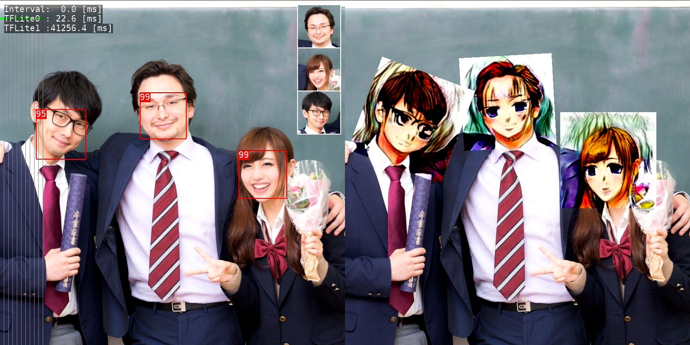

# tflite_selfie2anime
Generate anime-style face image.
 - Invoke Tensorflow Lite with [selfie2anime](https://github.com/margaretmz/selfie2anime-e2e-tutorial/).

 

# Reference
- https://github.com/margaretmz/Selfie2Anime-with-TFLite
- https://github.com/margaretmz/selfie2anime-e2e-tutorial/
- https://github.com/taki0112/UGATIT
